## Quick Navigation

- [ANIMALS](#animals)
  - [Rat Swarm](#rat-swarm)
  - [Wolves](#wolves)
  - [Rhinos](#rhinos)

- [CONSTRUCT](#constructs)
  - [Animated Jacket](#animated-jacket)
  - [Animated Shackles](#animated-shackles)

- [DRAGONS](#dragons)

- [FEY](#fey)

- [HAUNTS](#haunts)
  - [Blood-Writ Names](#blood-writ-names)
  - [Cold Spot](#cold-spot)
  - [Ghostly Brands](#ghostly-brands)
  - [Mouring Maiden](#mouring-maiden)
  - [Slamming Portal](#slamming-portal)

- [HUMANOIDS](#humanoids)
  - [Gibbs](#gibbs)
  - [Orcs](#Orcs)

- [MAGICAL BEASTS](#magical-beasts)
  - [Stirges](#stirges)

- [MONSTER HUMANOIDS](#monster-humanoids)

- [OOZES](#oozes)
  - [Grey Ooze](#grey-ooze)

- [OUTSIDERS](#outsiders)
  - [Devils](#devils)

- [PLANTS](#plants)
  - [Fiendish Leshy](#fiendish-leshy)

- [UNDEAD](#undead)
  - [Burning Skeletons](#burning-skeletons)
  - [Crawling Hands](#crawling-hands)
  - [Ectoplasmic Human](#ectoplasmic)
  - [Flaming Skull](#flaming-skull)
  - [Poltergeist](#poltergeist)
  - [Screaming Heads](#screaming-heads)
  - [Skeletons](#skeletons)
  - [Vampires](#vampires)
  - [Zombies](#zombies)
  - [Ghouls](#ghouls)
    - [Ghasts](#ghasts)

- [VERMIN](#vermin)
  - [Giant Centipedes](#giant-centipedes)
  - [Giant Crab Spiders](#giant-crab-spiders)

---
# Animals
Bir hayvan; yaşayan, insan dışı, genellikle sihirli yetenekleri ve doğuştan gelen bir dil veya kültür kapasitesi olmayan omurgalı bir yaratıktır. Hayvanlar genellikle nasıl yoldaş (companion) olarak hizmet edebileceklerine dair ek bilgiler içerir.

## Rat Swarm
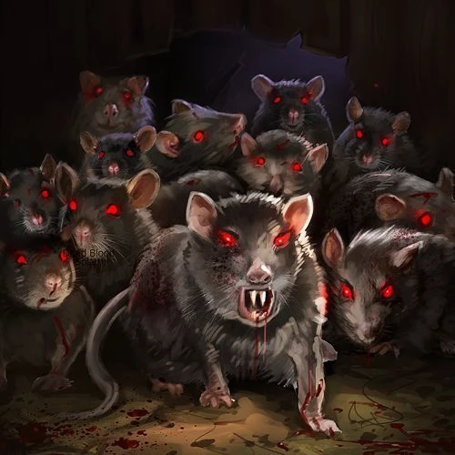

Ciyaklayan sıçanlardan oluşan, kıvranan ve çalkalanan bir kütle; dişlerini gıcırdatarak ve yoluna çıkan her şeyi tırmalayarak yaklaşmaktadır.

Bir sıçan sürüsü tipik olarak, fantastik ve karşı konulamaz bir açlığın körüklediği, alışılmadık derecede yüksek bir saldırganlıkla hareket eden, hastalık taşıyan yüzlerce sıçanın ısıran ve kaynaşan kütlesinden oluşur.

Özel Saldırılar: Hastalık

Yakın Dövüş: Sürü (swarm)

## Wolves
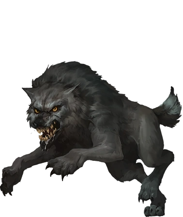

Bu güçlü köpek türü, keskin beyaz dişlerinin üzerinde dilini gezdirerek avını delici sarı gözlerle izler.

Yakın Dövüş: Isırma (bite)

İster tek başlarına ister sürüler halinde dolaşsınlar, kurtlar besin zincirinin en tepesinde yer alırlar.

## Rhinos
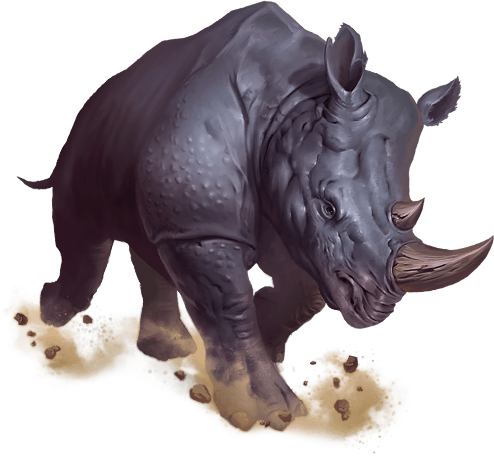

Rhinoların kalın derileri onlara büyük koruma sağlar. Charge attackları yüksek damagelar çıkarırken, durduklarında vurduğu hasarlar daha düşüktür. 

---
# Construct
Bir yapay; canlandırılmış bir nesne veya yapay olarak yaratılmış bir yaratıktır.

## Animated Shackles
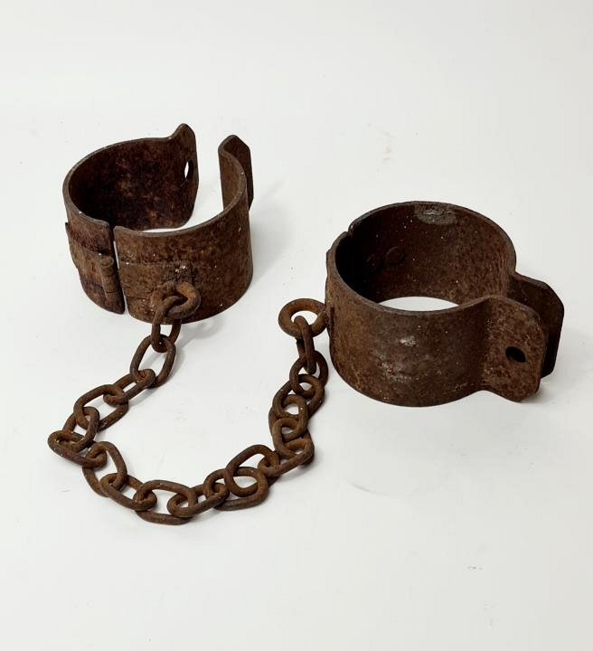

Canlandırılmış nesne tek bir canavar değil, koca bir kategoridir. Karakterleri prangalamaya (zincire vurmaya) çalışırlar.

## Animated Jacket
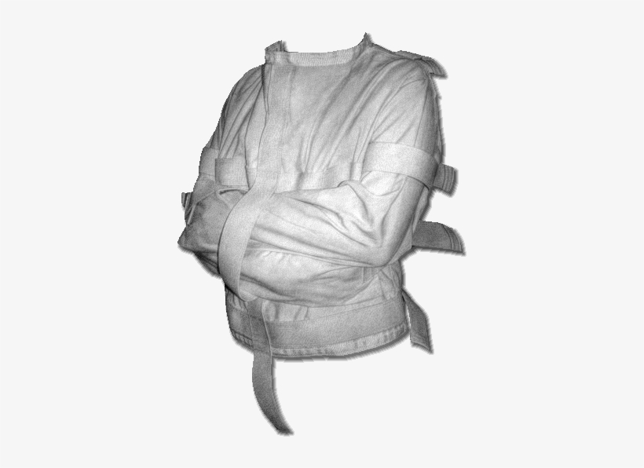

Canlandırılmış nesne tek bir canavar değil, koca bir kategoridir. Eğer ilk saldıran siz olursanız öldürülmesi oldukça kolaydır.

---
# Dragons

---

# Fey

---

# Haunts

Bir tuzak ile bir hortlak arasındaki fark, işin içine bir "musallat" girdiğinde bulanıklaşır. Musallat; yaşayanların varlığına şiddetle tepki veren, huzursuz ruhlar tarafından oluşturulmuş tehlikeli bir bölgedir. Bir musallatın ortaya çıkmasına neden olan kesin koşullar vakadan vakaya değişir; ancak musallatlar her zaman acı çeken, eziyet görmüş canlıların katlandığı müthiş bir zihinsel veya fiziksel ıstırap kaynağından doğar.

Tek bir acı kaynağı birden fazla musallat yaratabileceği gibi, birden fazla kaynak tek bir musallatta birleşebilir. Kaynağın göreceli gücünün, ortaya çıkan musallatın gücü üzerinde çok az etkisi vardır; musallatın gücünü belirleyen şey, onu yaratan acı veya çaresizliğin boyutudur. Genellikle hortlaklar, musallatların istila ettiği bölgelerde yaşarlar; hatta ölen bir kişinin hayalet (veya başka bir hortlak) olarak dirilmesi ve sayısız musallatın oluşmasını tetiklemesi bile mümkündür.

Bir musallat belirli bir alanı etkisi altına alır ve genellikle tek bir yapı içinde birden fazla musallatlı alan bulunur. Klasik bir "perili ev" tek bir musallat değil, genellikle yapının geneline yayılmış bir düzine veya daha fazla musallatlı alandan oluşur.

## Blood-Writ Names

## Cold Spot

## Ghostly Brands

## Mouring Maiden
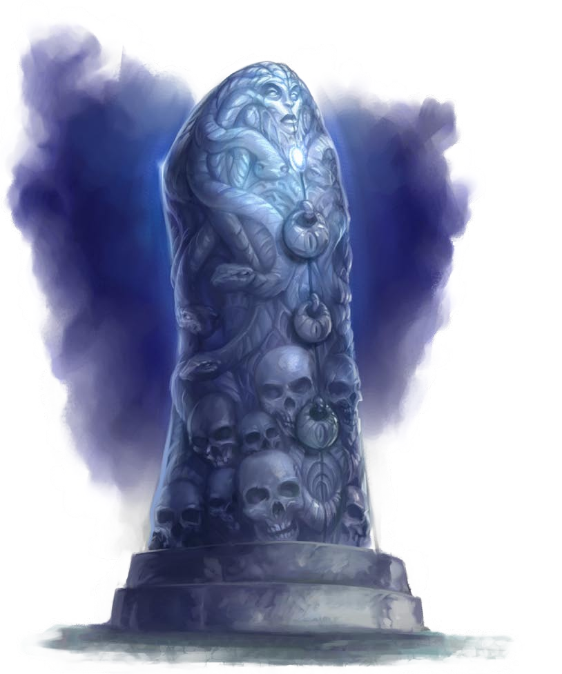

## Slamming Portal

---
# Humanoids
Bir insansı genellikle iki kola, iki bacağa ve bir kafaya ya da insan benzeri bir gövdeye, kollara ve bir kafaya sahiptir. İnsansıların doğaüstü veya olağanüstü yetenekleri azdır veya hiç yoktur; ancak çoğu konuşabilir ve genellikle gelişmiş toplumlara sahiptir. Genellikle Küçük (Small) veya Orta (Medium) boyuttadırlar (devler hariç). Her insansı yaratığın ayrıca insan, dev, goblinoid, sürüngen veya tengu gibi ırkına uygun belirli bir alt türü vardır.

## Orc
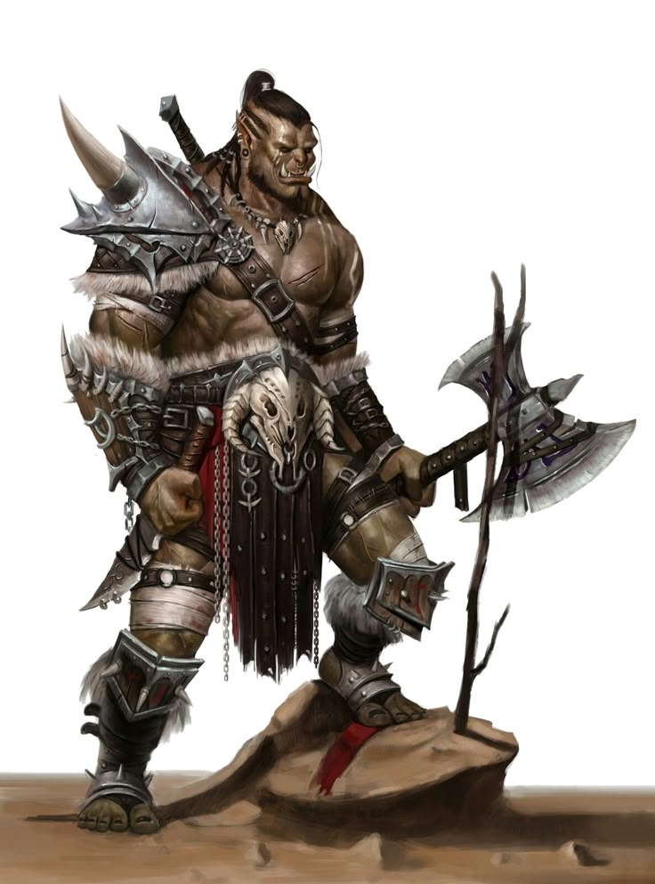

Orklar güç bazlı yaratıkları olsa dahi, aralarında barbarı, savaşçısı, avcısı veya nişancısı olabilir. Rage'e girebilirler ve yaptıkları saldırılar epey güçlüdür.

---
# Magical Beasts
Büyülü canavarlar hayvanlara benzerler ancak Zeka (Intelligence) skorları 2'den yüksek olabilir (bu durumda büyülü canavar en az bir dil bilir, ancak mutlaka konuşabilmesi gerekmez). Büyülü canavarlar genellikle doğaüstü veya olağanüstü yeteneklere sahiptir, ancak bazen sadece görünüş veya alışkanlık bakımından tuhaftırlar.

## Stirges
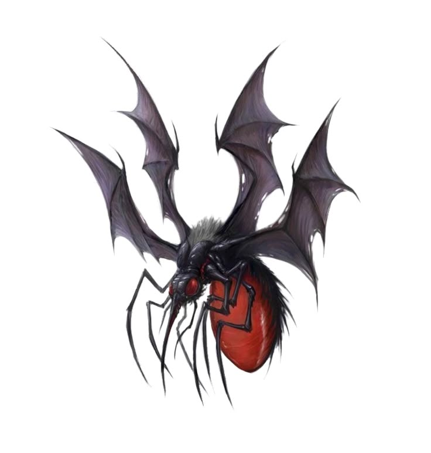

Bu böceğimsi yaratığın iki çift yarasa kanadı, birbirine karışmış ince bacakları ve iğne keskinliğinde bir hortumu (proboscis) vardır.

ÖN (SQ): Hastalıklı

Özel Saldırılar: Kan emme

Stirge'ler; vahşi hayvanları, besi hayvanlarını ve tedbirsiz yolcuları avlayan, bataklıklarda yaşayan saldırgan ve kan emici zararlılardır.

Bir stirge, bir düşmana yapışmış durumdaysa sırasının sonunda kan emerek 1 puan Bünye (Constitution) hasarı verir.

---

# Monster Humanoids

---

# Oozes
Bir peltemsi; şekilsiz veya değişken yapıda, genellikle zekası olmayan bir yaratıktır.

## Grey Ooze

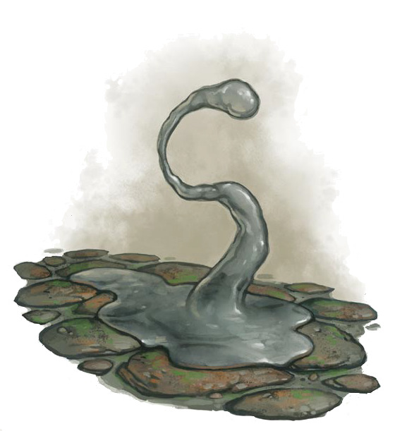

Sıradan görünen bir su birikintisi, nemli bir taş parçası veya parıldayan bir kaya; korkunç bir yalancı ayağın (pseudopod) dışarı fırlamasıyla birdenbire gerçek kimliğini açığa çıkarır.

- SQ: Şeffaf
- Özel Saldırılar: Asit, sıkıştırma (constrict)
- Yakın Dövüş: Ezme (slam)

Gri peltemsiyi kaplayan sindirim asidi metalleri ve organik maddeleri eritir. Gri peltemsi tarafından yakalanan (grappled) bir yaratığın giydiği zırh veya kıyafet, giyen kişi Refleks kurtarma atışında başarılı olamadığı sürece aynı miktarda asit hasarı alır. Canlı renklerden yoksun olması nedeniyle, çoğu ortamda bir gri peltemsiyi çevresinden ayırt etmek oldukça zordur.

---

# Outsiders
Bir outsider, en azından kısmen Materyal Düzlem dışındaki başka bir düzlemin özünden (materyalinden olması şart değildir) oluşur. Bazı yaratıklar hayata başka bir tür olarak başlar ve daha yüksek (veya daha düşük) bir ruhani varlık aşamasına ulaştıklarında outsidera dönüşürler.

## Devils
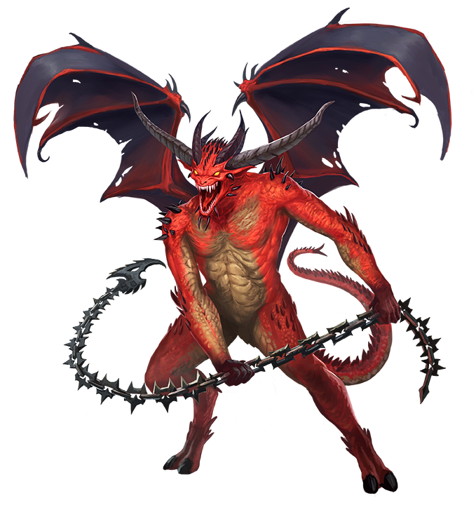

Şeytanlar, Cehennem düzleminden gelen "kanuni kötü" (lawful evil) outsiderlardır. Ateşe karşı bağışıklıkları vardır. Çok kurnaz olmalarına rağmen genellikle sözlerini tutarlar.

---

# Plants
Bu tür, bitkisel yaratıkları kapsar. Bahçelerde ve tarlalarda yetişen sıradan bitkilerin Bilgelik (Wisdom) ve Karizma (Charisma) skorlarının olmadığını; canlı olmalarına rağmen yaratık değil, nesne sayıldıklarını unutmayın.

## Fiendish Leshy
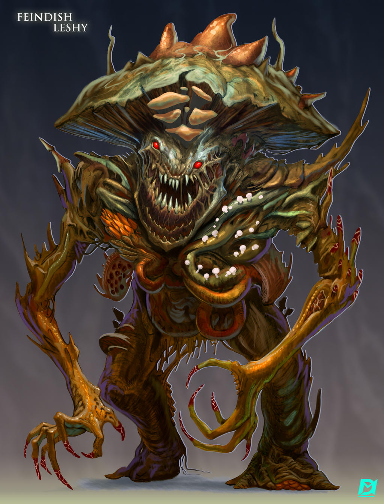

Aslında daha güçlü peri soyları (fey) ve zeki bitki yaşamı için hizmetkarlar olarak yetiştirilen leşiler; zeki olmayan kardeşlerine göz kulak olan ve doğanın yeşil gözcüleri olarak hizmet veren duyarlı bitkilerdir.

Leşiler grup olarak belirli ortak özellikleri paylaşırlar. Bitkilere benzerler ancak belli belirsiz insansı (humanoid) görünümleri vardır ve Küçük (Small) boyuttadırlar. Aynı türün leşileri aynı genel şekli paylaşsa da, leşiler görünüş olarak bitki dünyasının tüm çeşitliliğine sahiptir.

Şeytani Leşiler, yozlaşma, nekromansi veya kötü rünler nedeniyle ortaya çıkan kötücül leşilerdir.

Özel Saldırılar: Smite Good, Channel Energy

Küçük oldukları için ormanlık alanlarda onları tespit etmek ve öldürmek oldukça zordur.

---

# Undead 
Undeadler; ruhani veya doğaüstü güçler tarafından canlandırılmış, bir zamanlar yaşayan canlılardır.

## Burning Skeletons
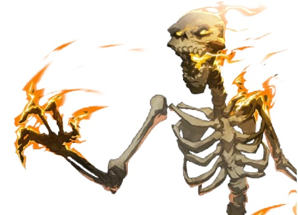

Kemik yığını aniden hareketlenir, insansı bir form almak üzere ayağa kalkar ve kızıl-turuncu alevler saçarak parlar. Uzun, kemikli parmakları, hiç sönmeyen bir ateşle yanarak yaşayanları tırmalamak için uzanır.

Yanan bir iskelete bitişik olan yaratıklar, turlarının başında ateş hasarı alırlar.

- SQ: Yakıcı Ölüm (fiery death)

- Zayıflık: Soğuk

- Bağışıklık: Ateş

- Yakın Dövüş: Pençe artı ateş veya 2 pençe artı ateş

- DR: Ezici (bludgeoning)

Yanan bir iskelet öldüğünde bir alev patlamasıyla infilak eder.

## Crawling Hands
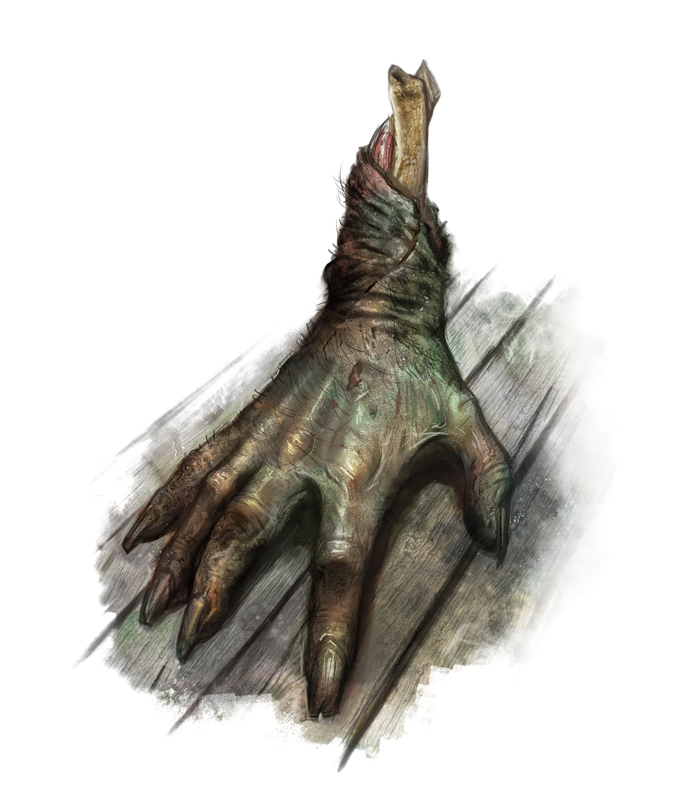

Sarsılarak canlanan bu kesik el, parmaklarını deforme olmuş bir örümcek gibi kullanarak büyük bir hızla ileri atılır.

## Ectoplasmic Human
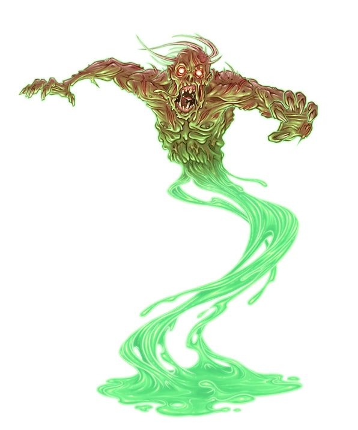

Bu yapışkan ve değişken kütle insansı bir şekle sahiptir ancak bir tür yapışkan halat veya kumaştan yapılmış gibi görünür. Gövdesi, bu korkunç formunu korumaya çalışırcasına kesik kesik ve sarsılarak hareket eder.

- Sürekli: air walk

- SQ: Safha Sarsıntısı (yarı ruhani / phase lurch)

- Yakın Dövüş: Ezme (slam)

Ektoplazmik bir yaratık, duvarların veya madde engellerin içinden geçme yeteneğine sahiptir.

## Flaming Skull
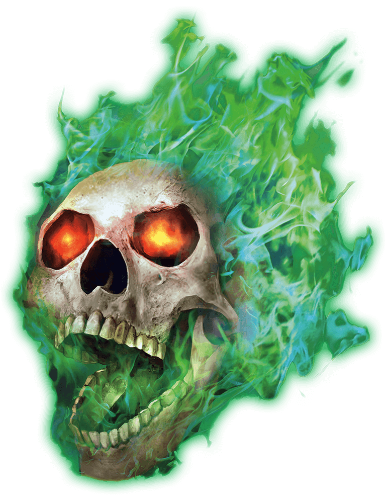

İnsansı bu kafa, havada sessizce ve uğursuzca süzülürken yüzünden hala et parçaları sarkıyor ve havada sallandıkça grileşmiş dişleri hafifçe birbirine çarpıyor. Aynı zamanda alevler içinde.

Yakın Dövüş: Slam

Öldürmesi kolaydır.

## Poltergeist
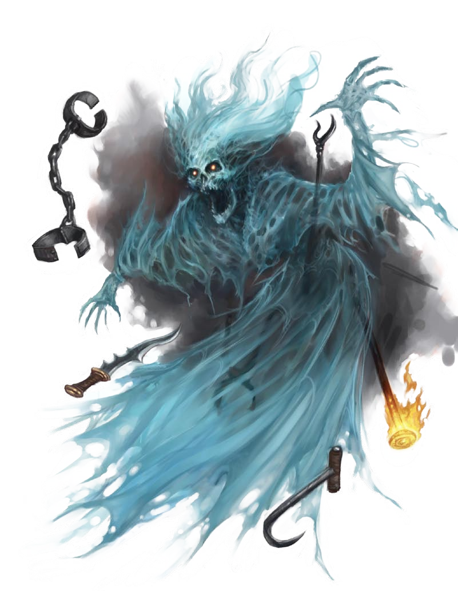

Hayaletimsi, iskeletimsi bir figür, aletler, tabaklar, mutfak gereçleri ve diğer serbest eşyalardan oluşan dönen bir kasırganın ortasında yükselir.

- Özel Nitelikler (SQ): Bölgeye Bağlı (Site bound)
- Özel Saldırılar: Telekinezi
- Savunma Yetenekleri: Incorporeal, Doğal Görünmezlik

Poltergeist, herhangi bir nedenle öldüğü yeri terk edemeyen bir yaratığın ruhundan oluşan öfkeli bir ruhtur.

## Screaming Skulls
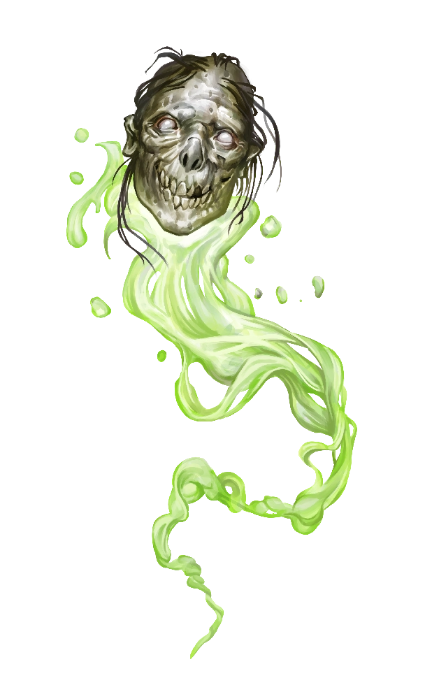

Çaresizlik ve acıdan gelen ürpertici bir çığlık duvarlarda yankılanır; ardından köşenin ardından alevler içinde yanan, çeneleriyle havayı çiğneyen mavi (azure) kafataslarının yaydığı hafif bir parıltı belirir.

- Özel Saldırılar: Çığlık (Screaming)

Can puanları (HP) oldukça düşüktür ancak onlara ulaşamazsanız ciddi bir baş ağrısına dönüşebilirler.

## Skeletons
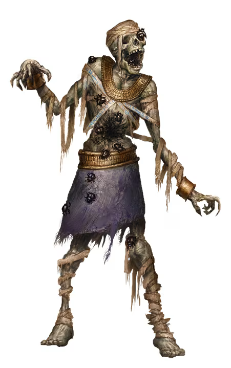

Kemik yığını aniden hareketlenir ve insan şeklini alarak yükselir. Uzun kemik parmakları, yaşayanlara pençe darbeleri vurmak için uzanır.

- Yakın Dövüş: 2 Pençe (veya varsa elindeki silahı kullanır)
- Zayıflıklar: Bludgeoning silahlardan ekstra hasar alır.

İskeletler, lanetli büyü (foul magic) aracılığıyla yaşama döndürülmüş ölülerin canlandırılmış kemikleridir.

## Vampires
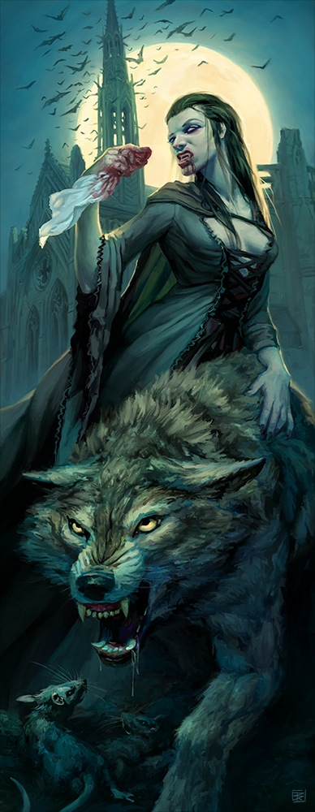

Bazı kötülükler bir anda çökmez insanın üzerine. Önce uzaktan izler. Sonra adını öğrenir.
Ardından sesini, korkularını, hangi saatte yalnız kaldığını, hangi anlarda güçsüz düştüğünü
bilir. Vampirler işte böyledir. Onlar, yalnızca gecede avlanan namevtler değil; sabrı öğrenmiş
açlık, zarafeti kuşanmış çürüme ve insan suretine bürünmüş karanlıktır. Yaşayanların kanıyla
beslenirler, fakat onları korkunç kılan yalnızca bu değildir. Asıl dehşet, çoğu zaman
hayattayken nasıllarsa öyle görünmeleri, hatta bazen ölümün onlara tuhaf bir güzellik,
keskinlik ya da yabani bir asalet katmış olmasıdır.

Bir vampirin yanında hissedilen ilk şey çoğu zaman açık bir tehdit değil, dünyanın düzeninde
beliren ince bir eğriliktir. Gözleri karanlığı olağan insanlardan daha iyi deler; bakışları
yalnızca görüneni değil, gizleneni de yokluyormuş hissi verir. Hareketlerinde ürpertici bir
çeviklik, duruşlarında taş kadar eski bir sükûnet vardır. Güçleri kabadır ama kabalığa ihtiyaç
duymazlar; süratleri hayvansıdır ama hayvanlar gibi acele etmezler. Onlar sessizce yaklaşır,
ikna eder, bekler ve çoğu zaman avlarını parçalamadan önce çoktan çözmüş olurlar. Yalanı,
ikiyüzlülüğü, korkuyu ve tereddüdü okumakta ustadırlar; insan ruhundaki en küçük çatlağı
sezmekte neredeyse doğaüstü bir yetenek taşırlar.

Kana duydukları iştah yalnızca bedensel değildir. Vampir için kan, yaşamın özü, iradenin
sıcaklığı ve faniliğin son parlak hatırasıdır. Kurbanına yalnızca saldırmaz; onu kendine çeker,
tutar, bastırır, sonra usul usul tüketir. Bu yüzden vampirin ziyafeti vahşi bir parçalayıştan çok,
sahiplenmeye benzeyen karanlık bir yakınlıktır. Fakat onların dokunuşunda yalnızca açlık
yoktur; hayatı solduran, insanı bir anda güçsüz ve eksik bırakan mezar soğuğu da vardır.
Bazı kurbanlar yalnızca kan kaybetmiş gibi değil, sanki içlerinden bir parça sökülüp alınmış
gibi çöker. Vampirin yakınında ölüm her zaman bir son gibi gelmez; bazen daha kötü bir
dönüşümün başlangıcı gibi hissedilir.

Çünkü vampir yalnız avlanmaz; hükmeder. Bazıları insanın iradesini gözleriyle ezer,
sesleriyle büker, düşüncesini ağır bir sis gibi kaplayıp onu kendi isteğine yabancılaştırır.
Onların buyruğuna giren kişi kimi zaman bunu emir olarak bile duymaz; sanki kendi aklıyla
vermiş olduğu bir karar sanır. Daha korkuncu, vampirin öldürdüğü bazı kurbanlar mezarda
sessiz kalmaz. Uygun olanlar, birkaç gecenin ardından yeniden doğrulup efendilerinin
gölgesine bağlanabilir; kendilerine ait hayatları sona ermiş, iradeleri başka bir karanlığa
zincirlenmiş hâlde. Böylece bir vampirin çevresinde yalnızca kurbanlar değil, efendisinin yok
oluşuna dek ona boyun eğen hizmetkârlar da birikir.

Onların geceyle olan bağı yalnızca şiirsel değildir; gecenin yaratıkları da çoğu zaman onları
tanır. Sıçanlar, yarasalar, kurtlar ya da bölgenin karanlığına yakışan başka avcı hayvanlar,
sanki eski bir efendinin çağrısını duymuş gibi onlara yönelebilir. Bu yüzden bir vampirin
hüküm sürdüğü topraklarda doğa bile tam anlamıyla masum kalmaz. Mahzenlerde
kemirgenler fazla cesurlaşır, çan kulelerinde yarasalar gereğinden kalabalık toplanır, orman
kenarında kurtların uluması insan sesini andıracak kadar uzun sürer. Bunların hepsi, gecenin
bir yerinde bir iradenin uyanık olduğuna dair uğursuz işaretlerdir.
Vampirlerin sureti de sabit değildir. İstediklerinde yırtıcı bir yarasanın ya da avını sabırla
izleyen bir kurdun biçimine bürünebilirler; daha da kötüsü, yenilgi anında ya da gizlenmeleri
gerektiğinde sis olup aralıklardan, çatlaklardan, kilit altlarından akabilirler. Duman gibi hafifler
ama yok olmazlar; yalnızca bedenin sertliğini bırakıp kötülüğün özüne daha çok benzer hâle
gelirler. Büyük yıkım aldıklarında bile sonları her zaman orada ve hemen gelmez. Çoğu,
dağılan bedenini geride bırakıp mezarına, tabutuna, saklı istirahat yerine dönmeye çalışır.
Sanki ölüm bile onları bir anda kabul etmek istemez; onları yeniden toparlanıp gecenin içine
dönmeleri için kısa bir mühletle geri salar. Bu da vampiri öldürmeyi, sıradan bir canavarı
devirmekten çok daha korkunç ve kişisel bir işe dönüştürür.

Onları tekinsiz yapan şeylerden biri de doğanın bazı işaretleriyle kurdukları bozuk ilişkidir.
Ayna karşısında gerçek bir yüz taşımazlar; yansımaları görünmez, sanki dünyanın parlak
yüzeyi onları tanımayı reddeder. Gölge de onlara tam ait değildir; kimi vampir neredeyse
gölgesizmiş gibi görünür. Duvarlar, kuleler, tavan kirişleri onlar için engel olmaktan çıkabilir;
örümcek gibi dik yüzeylere tutunup yukarı süzülebilirler. Bir odada duruşları bazen heykel
kadar hareketsizdir, sonra göz kırpımı kadar kısa bir anda bambaşka bir yere geçmiş olurlar.
İnsan aklı, o hareketi izlediğini sansa bile sonradan onu düzgünce hatırlayamaz.
Fakat her karanlık kudret gibi onların da kendilerine mahsus sınırları ve aşağılanmaları
vardır. Vampir, sarımsağın ağır kokusundan tiksinir; böyle kokuyla kuşatılmış yerlere
yaklaşmak istemez. Aynalar ve kuvvetle öne sürülen kutsal semboller onları geri iter; bu
nesneler onları yakmasa bile üzerlerinde aşağılayıcı bir itme yaratır, sanki varlıklarının
yalanını yüzlerine vurur. Daha da eski ve daha korkutucu bir kural vardır: Bir vampir, özel bir
eve ya da gerçek anlamda bir yuvaya davetsiz giremez. Kapıyı kırmak başka şeydir, eşiği
geçmek başka. Bir haneye ait o görünmez hak, mezarın ötesinden dönmüş bu açlığa bile bir
an için “buraya kadar” diyebilir. Bu yüzden bazen bir evin en büyük savunması taş duvarı
değil, içeriden verilmemiş tek bir sözdür.

Yine de onların asıl düşmanı insan değil, dünyanın saf kuvvetleridir. Güneş, vampirin taşıdığı
geceyi affetmez; çıplak gün ışığı altında güçleri çöker ve kısa sürede varlıkları dağılmaya
başlar. Akan su da onlar için güvenli değildir; nehir, dere, çağlayan ya da canlı akış taşıyan
su yolları vampir bedenini sanki dünyanın kendisi yıkıyormuş gibi aşındırır. Bu yüzden çoğu
vampir köprüleri, mahzenleri, kapalı geçitleri, kuru yolları ve gölgeyi sever; açık gök ile
hareketli su onların asırlık gururuna karşı yaratılışın sessiz cevabıdır. Onları gerçekten sona
erdirmenin yolları da bu nedenle her zaman vahşi ama ritüel doludur: çaresiz bırakılmış
bedenin kalbine saplanan kazık, koparılan baş ve kutsanmış suyla tamamlanan son hakaret,
mezarın inadını nihayet susturabilir.

Birçok vampir bu yüzden kendine bir sığınak, bir tabut, bir geri dönüş noktası hazırlar. Çünkü
ne kadar kudretli olursa olsun, gece yaratığı da yenilgi ihtimalini tanır. Malikânesinin en gizli
odası, aile mezarlığının altındaki taş hücre, unutulmuş bir şapelin mahzeni ya da toprağın
derinindeki işlemeli bir sanduka… bunlar yalnızca barınak değil, vampirin ikinci kalbidir.
Oraya çekildiğinde toparlanır, yeniden biçim kazanır, sonra hıncıyla birlikte geri döner. Bu
yüzden vampir avı yalnızca yaratığı bulmak değil, onun döneceği yeri de keşfetmek
demektir; aksi hâlde gece, mağlup edilmiş sandığınız kötülüğü ertesi akşam yeniden
kapınıza getirebilir.

Ve bütün bu uğursuz özelliklerine rağmen vampiri asıl dehşet verici yapan, çoğu zaman hâlâ
konuşabilmesi, düşünebilmesi, hatta kimi şeyleri takıntı derecesinde sevebilmesidir. Zekâları
keskindir, sezgileri güçlüdür, bakışları delici, sözleri aldatıcı derecede yumuşak olabilir. Uzun
çağların birikimi onlara yalnızca bilgi değil, kibir de verir. Kendilerini ölümlülerin üstünde
görürler; ama aynı anda yaşayanların sıcaklığına, değişebilirliğine ve hâlâ akan zamana
karşı derin bir haset taşırlar. İşte bu yüzden bir vampir yalnızca mezardan çıkmış bir avcı
değildir. O, canlı olana özlem duyan ama artık ona ait olamayan bir lanettir; güzel yüzlü bir
açlık, sabırlı bir felaket, davet bekleyen bir kabus, adıyla çağırdığı insanı önce seyreden,
sonra isteyen, en sonunda da kendi sessiz gecesine katmaya çalışan konuşan bir mezardır

## Zombies
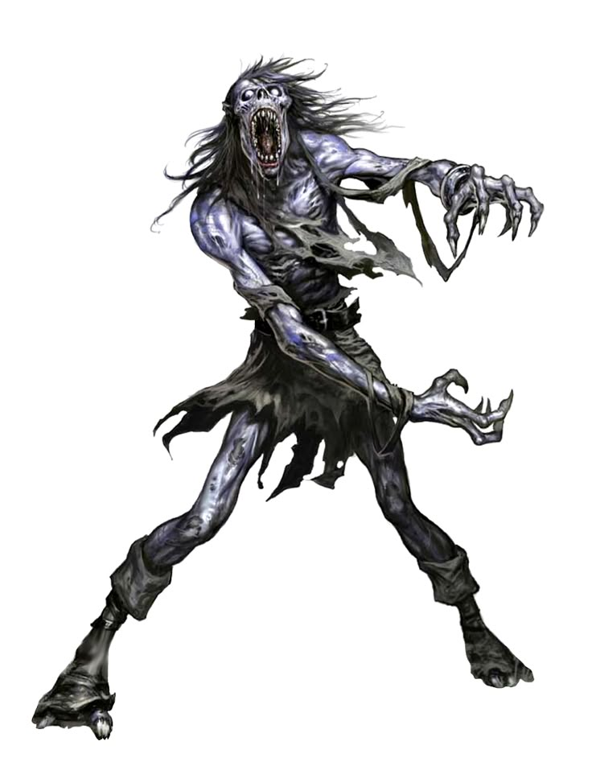

Üzerinde sadece birkaç kirli paçavra olan bu yürüyen ceset, kollarını öne uzatmış bir halde sendeleyerek ilerliyor, etleri kemiklerinden dökülüyor.

- Yakın Dövüş: Slam
- Zayıflıklar: Kesici (Slashing) silahlardan ekstra hasar alır.

Düşük seviyeli bir undead yaratıktır.

## Ghouls

Uzun ve keskin dişlere sahip bu insansı yaratığın soluk teni, açlıktan kurumuş iskeleti üzerinde sıkıca gerilmiştir.

- Yakın Dövüş: Isırık (hastalık ve felç), 2 Pençe (felç)
- Özel Saldırılar: Felç
- Savunma Yetenekleri: Channel Resistance
- Can Puanı: Oldukça düşük
- Hastalık: Gulyabani Ateşi

Gulyabaniler, köyleri ve mezarlıkları mesken tutan, cesetlerle beslenen undead yaratıklardır. Genellikle sürüler halinde bulunurlar.

## Ghasts

Yakın Dövüş: Isırık (hastalık), 2 Pençe
Özel Saldırılar: Felç, İğrenç Koku (Stench)
Bu yaratıklar, alt sınıf akrabalarına (sıradan gulyabanilere) fiziksel olarak çok benzeseler de çok daha ölümcül ve kurnazdırlar. Gastlar ya kendi türlerinden oluşan sürüler halinde dolaşır ya da sıradan gulyabani gruplarına liderlik ederler. Bu yaratıkların etrafını saran ölüm ve çürüme kokusu dayanılmaz boyuttadır ve yaklaşanı hasta eder.

---

# Vermin
Bu tür; böcekleri, örümcekgilleri, diğer eklem bacaklıları, solucanları ve benzeri omurgasızları içerir.

## Giant Centipedes

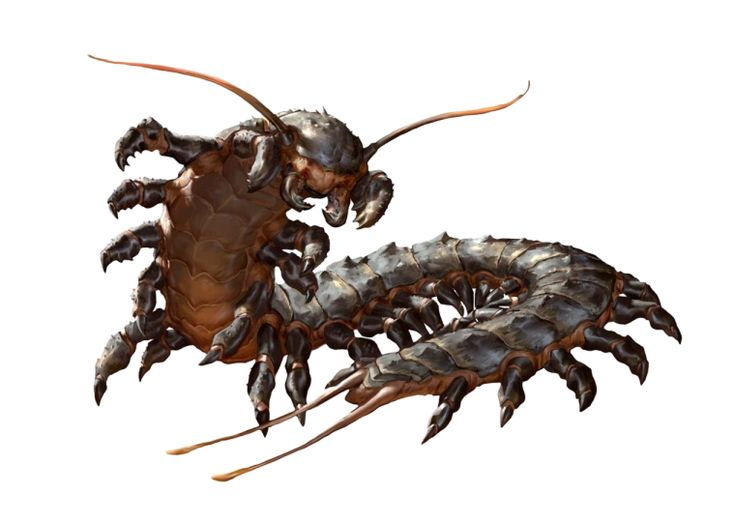

Halkalı vücuduyla kıvranıp duran bu tüyler ürpertici yaratık, avını ararken zehirli çenelerini kasıp gevşetiyor.

- Yakın Dövüş: Isırık (zehir)
- Özel Saldırılar: Zehir

## Giant Crab Spiders

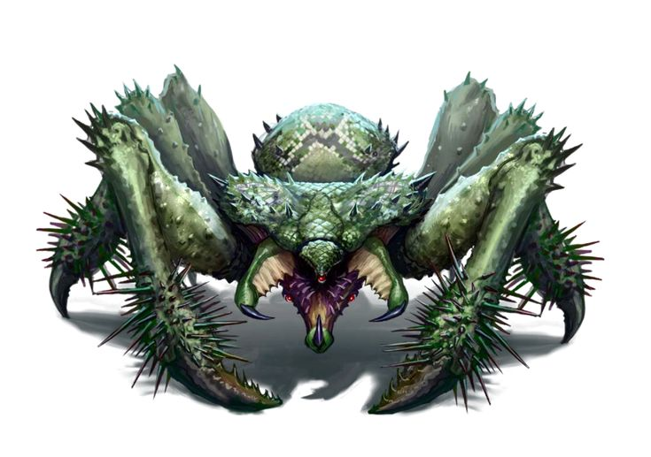

Soluk sarı renkli bu örümceğin bacakları iki yana doğru uzanarak ona oldukça belirgin bir duruş kazandırıyor. Yaratığın boyutu büyük bir köpek kadar.

Yakın Dövüş: Isırık (zehir)

Dev yengeç örümcekleri tehlikeli pusu avcılarıdır.
